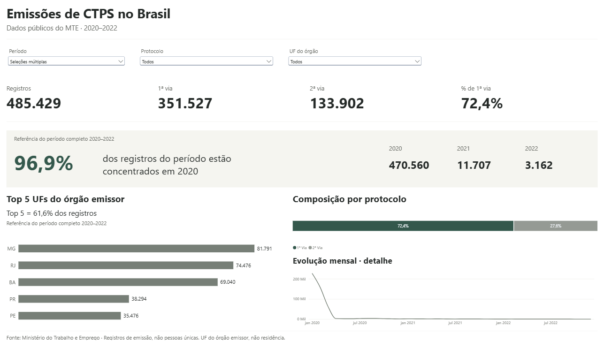
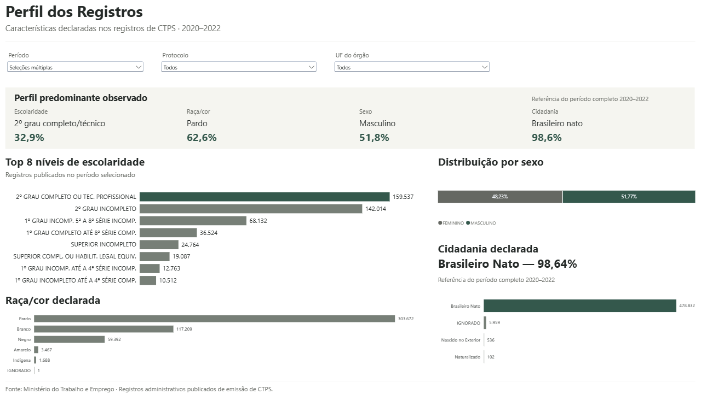
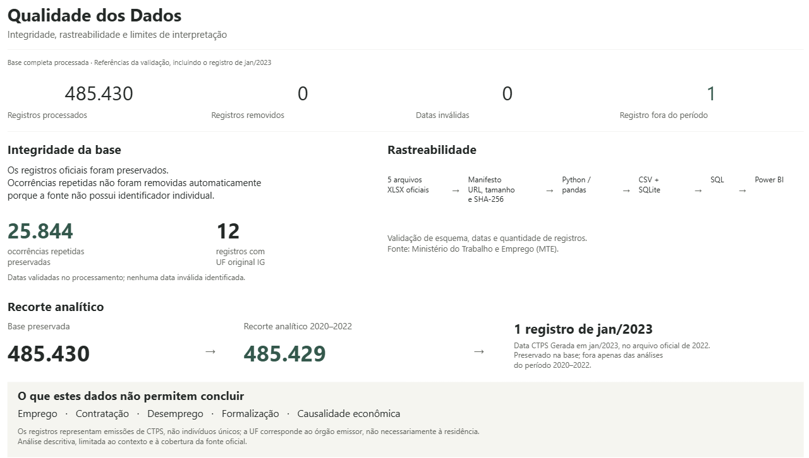
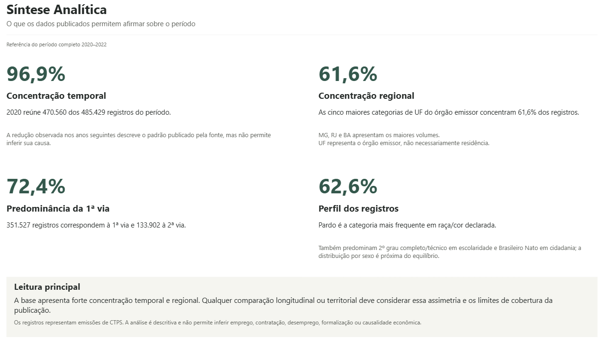
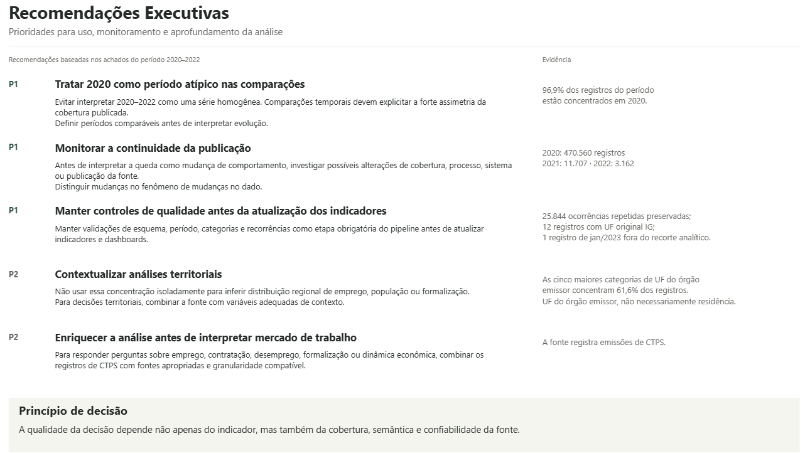

# Emissões de CTPS no Brasil — 2020 a 2022

Análise descritiva e reproduzível dos registros públicos de emissão de Carteira de Trabalho e Previdência Social (CTPS), publicada pelo Ministério do Trabalho e Emprego (MTE). O projeto conecta qualidade de dados, análise e prioridades de uso da informação em um dashboard Power BI com cinco páginas.



## Visão geral

O projeto examina a distribuição dos registros por período, UF do órgão emissor, protocolo e características declaradas. A análise considera a cobertura e a qualidade da fonte antes de orientar comparações e aprofundamentos.

- **Fonte:** [estatísticas oficiais da CTPS](https://www.gov.br/trabalho-e-emprego/pt-br/servicos/trabalhador/carteira-de-trabalho/estatisticas)
- **Período principal:** `Data CTPS Gerada` entre `2020-01` e `2022-12`
- **Base completa preservada:** 485.430 registros, sem remoção de ocorrências repetidas
- **Recorte analítico do dashboard:** 485.429 registros em 2020–2022; o registro de jan/2023 permanece na base
- **Tecnologias:** Python, pandas, matplotlib, SQLite, SQL e Power BI

## Principais resultados

Valores de referência do dashboard para o período completo 2020–2022, sem outros filtros:

- **1ª via:** 351.527 registros (**72,4%**); **2ª via:** 133.902 (**27,6%**).
- **Concentração temporal:** 2020 reúne 470.560 registros (**96,9%**), ante 11.707 em 2021 e 3.162 em 2022. O maior volume mensal foi janeiro de 2020, com 227.013; dezembro de 2022 teve 62. A fonte não permite inferir a causa dessa redução.
- **Concentração regional:** MG lidera com 81.791 registros (**16,8%**); as cinco maiores categorias de UF do órgão emissor somam 299.077 (**61,6%**). UF não representa necessariamente residência.
- **Perfil declarado:** Pardo é a categoria mais frequente em raça/cor (**62,6%**). Esses atributos descrevem registros, não pessoas únicas.

Os [insights](reports/insights.md) e as [tabelas analíticas do pipeline](reports/tables/) usam o recorte 2020–2022. Qualidade e repetições são verificadas na base completa, conforme a [documentação das páginas](powerbi/dashboard_spec.md).

## Dashboard Power BI

As cinco capturas apresentam o dashboard final aprovado. Visão Geral e Perfil dos Registros permitem explorar **Período, Protocolo e UF do órgão**. Qualidade, Síntese e Recomendações não têm filtros operantes; as duas últimas são páginas documentais com textos fixos.

### 1. Visão Geral

Captura exibida no início deste README. Indicadores compactos, concentração em 2020, comparação anual, Top 5 UFs, composição do protocolo em barra 100% e evolução mensal como detalhe. Os destaques fixos são identificados como referência do período completo.

<details>
<summary>2. Perfil dos Registros</summary>

Escolaridade Top 8, raça/cor em barras, sexo em barra 100% e cidadania compacta. A faixa “Perfil predominante observado” apresenta referências fixas de 2020–2022, distintas dos gráficos exploratórios.



</details>

<details>
<summary>3. Qualidade dos Dados</summary>

Integridade da base completa, ocorrências repetidas preservadas, categoria original IG, rastreabilidade e diferença entre 485.430 registros preservados e 485.429 no recorte. Explicita os limites de interpretação.



</details>

<details>
<summary>4. Síntese Analítica</summary>

Quatro achados documentais: concentração temporal (96,9%), regional (61,6%), predominância da 1ª via (72,4%) e principal categoria de raça/cor declarada (62,6%). As ressalvas delimitam o que a publicação permite afirmar.



</details>

<details>
<summary>5. Recomendações Executivas</summary>

Traduz os achados em prioridades para comparação temporal, monitoramento da continuidade da fonte, controles de qualidade, contextualização territorial e enriquecimento analítico antes de conclusões sobre mercado de trabalho. Não propõe políticas públicas nem conclusões causais.



</details>

**Arquivos finais:** o [PBIX](powerbi/dashboard_ctps_2020_2022.pbix) e o [projeto editável PBIP](powerbi/CTPS.pbip) representam o mesmo relatório de cinco páginas mostrado nas capturas. O PBIX foi salvo a partir do projeto aprovado, sem refresh.

## Pipeline

```text
Fonte oficial
    ↓
Download e manifest SHA-256
    ↓
Validação de arquivos e esquema
    ↓
Transformação com pandas
    ↓
CSV processado e SQLite
    ↓
Consultas SQL e agregações
    ↓
Tabelas, gráficos e insights
    ↓
Dashboard Power BI e recomendações de uso dos dados
```

O código principal está em [`src/ctps_pipeline.py`](src/ctps_pipeline.py). As consultas analíticas estão em [`sql/analises.sql`](sql/analises.sql). O relatório de qualidade fica em `data/processed/quality_report.json` após a execução.

## Decisões metodológicas

- **Repetições de registros:** 25.844 linhas excedentes após a primeira ocorrência de cada combinação das 18 colunas de negócio foram preservadas. Essa contagem não representa pessoas nem combinações únicas. A fonte não fornece um identificador de atendimento ou de pessoa que permita classificá-las como duplicatas indevidas.
- **Registro `2023-01`:** o valor existe em `dados_ctps_2022.xlsx`, com protocolo e emissão em `2022-12`. Foi mantido para não alterar a fonte silenciosamente e está detalhado em [`reports/tables/emissoes_fora_intervalo.csv`](reports/tables/emissoes_fora_intervalo.csv).
- **Datas de protocolo:** 15.017 protocolos são anteriores a 2020. Eles representam histórico do atendimento e não são usados para recortar a série principal, baseada em `Data CTPS Gerada`.
- **Categoria original IG:** 12 registros foram preservados sem atribuir uma UF presumida.
- **Interpretação:** emissão de CTPS é um registro administrativo. Não mede emprego, contratação, desemprego, formalização, pessoas únicas ou causalidade econômica.
- **Arquivos brutos:** não são versionados por tamanho e por serem obtidos de fonte pública; o download é reproduzível pelo manifest e seus hashes.

## Tecnologias

Python 3.11+, pandas, matplotlib, openpyxl, SQLite, SQL e Power BI (Power Query e DAX documentados).

## Como reproduzir

```bash
python -m venv .venv
```

No Windows PowerShell:

```powershell
.\.venv\Scripts\Activate.ps1
pip install -r requirements.txt
python scripts/download_source.py
python -m src.ctps_pipeline --source-dir data/raw --output-dir data/processed
pytest
$env:CTPS_SOURCE_DIR = "data/raw"
pytest -m integration
```

O pipeline gera o CSV e SQLite processados, `quality_report.json`, tabelas agregadas, gráficos e `reports/insights.md`. Os testes unitários ficam em `tests/test_pipeline.py`; o teste de integração usa fontes locais quando `CTPS_SOURCE_DIR` está definido.

## SQL e Power BI

[`sql/analises.sql`](sql/analises.sql) consulta a tabela `ctps_emissoes` no SQLite. Em [`powerbi/`](powerbi/) estão:

- [`PowerQuery.m`](powerbi/PowerQuery.m), para importar e tipar o CSV;
- [`medidas.dax`](powerbi/medidas.dax), com medidas explícitas;
- [`modelo.md`](powerbi/modelo.md) e [`dashboard_spec.md`](powerbi/dashboard_spec.md), como referência técnica do modelo e documentação das cinco páginas atuais.

## Limitações

As datas têm granularidade mensal e os arquivos podem ter diferenças históricas de preenchimento. Não há identificador de pessoa ou atendimento, portanto não é possível medir pessoas únicas ou reincidência. As comparações descrevem os registros publicados pelo MTE e não devem ser usadas como estimativa de emprego, desemprego, tamanho de mercado ou impacto de política pública.
